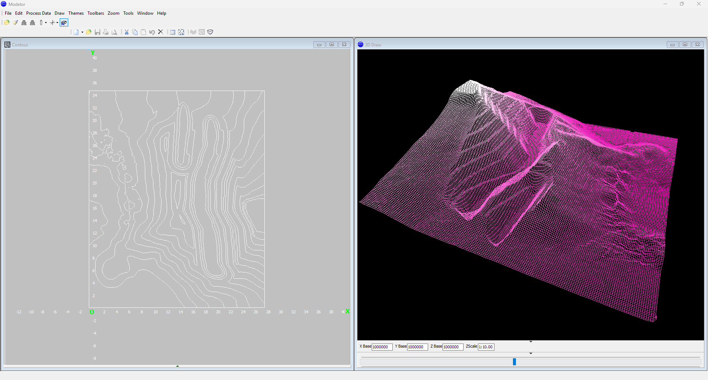
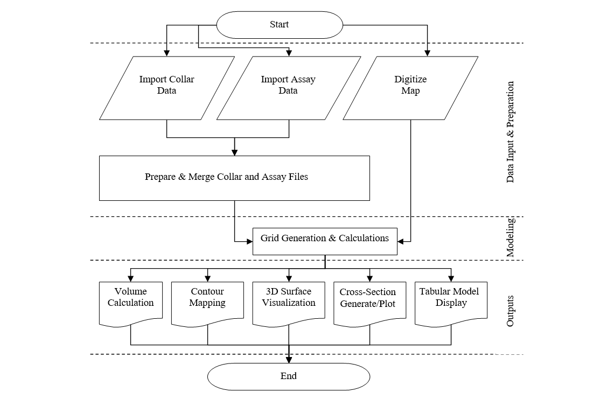
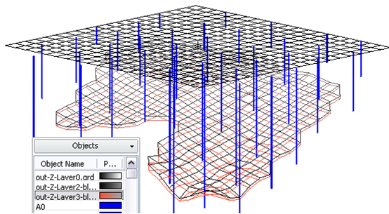
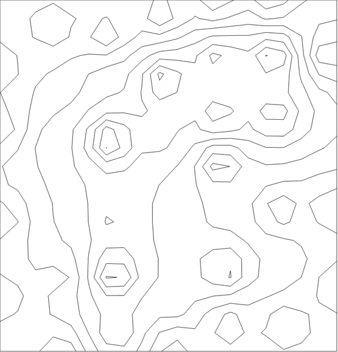

# Modelor – 2D Modeling Software for Tabular Ore Deposits (2007)

**Early Iranian software for 2D resource modeling, volume calculation, and operational geometry combination.**

> Historical technical portfolio project (Bachelor's thesis era – 2007).  
> Source code is no longer available. Binary executable and documentation are provided for reference.

---

### Evolution & Next Gen

Modelor represented my early work (2007) in 2D/3D spatial modeling and volume estimation for mining.  
This foundational domain expertise evolved years later into **[Plan2Cost](https://github.com/YOUR_USERNAME/plan2cost)** — incorporating modern Computer Vision and Hybrid ML engines for automated cost and structural estimation from floor plans.

---

## What it does

- Builds 2D grid models from exploration data (Collar + Assay) using **Inverse Distance to a Power**
- Generates contour maps and 3D surfaces (OpenGL)
- Calculates layer volumes using the **trapezoidal method**
- Creates cross-sections in any direction
- Supports map digitization

**Real-world usage:**  
Used to combine Surfer (Kriging) topography and pit models with operational geometry (benches and ramps) and calculate excavation volumes for cost estimation.

---

## Screenshots

| 3D Surface + Contour | Workflow |
|----------------------|----------|
|  |  |

| Orthographic View with Boreholes | Thickness & Grade Models |
|----------------------------------|--------------------------|
|  |  |

---

## Workflow

1. **Data Preparation**
   - Import Collar and Assay files
   - Digitize maps / topography
   - Merge and prepare data

2. **Model Construction**
   - Define grid size and boundaries
   - Interpolate using Inverse Distance
   - Generate 2D grid models (thickness, grade, roof, floor, etc.)

3. **Analysis & Output**
   - Volume calculation
   - Contour maps
   - 3D surface visualization
   - Cross-sections
   - Tabular model display

---

## Key Technical Details

| Feature              | Method / Technology          |
|----------------------|------------------------------|
| Estimation           | Inverse Distance to a Power  |
| Volume Calculation   | Trapezoidal method           |
| Visualization        | OpenGL (3D surfaces)         |
| Language             | Delphi                       |
| Platform             | Windows                      |

---

## Limitations

- Only Inverse Distance estimation (no Kriging or geostatistical methods)
- Assumes vertical boreholes
- No fault or structural modeling
- 2007-era technology (Delphi + OpenGL)
- Source code is lost

---

## Binary Executable

The original Windows executable is available in the **[Releases](../../releases)** section of this repository.  
Please scan it with your antivirus before running (legacy software).

---

## Citation

If you reference this work, please cite:

> Goudarzi, M. (2007). Modelor: A software tool for modeling tabular deposits.  
> Original Persian paper available in `/docs`.  
> This repository: https://github.com/madjidguodarzi/modelor-tabular-deposit-modeling

---

## License

MIT License – see [LICENSE](LICENSE) file.
